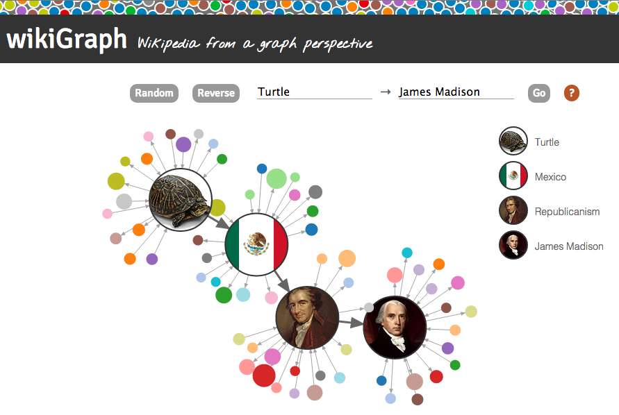
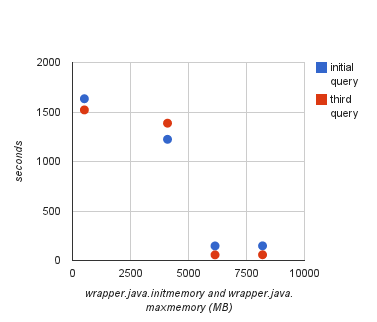

wikiGraph
===========
What connects two topics on Wikipedia? For example, how many links do you have to click to get from Harry Potter to the Spanish Inquisition?* Combining trivia nerdery with graph theory, wikiGraph allows users to find and explore the paths within Wikipedia.

You can check out the project [here](http://ec2-54-148-235-143.us-west-2.compute.amazonaws.com/).

*It takes a minimum of 3 clicks. Here's one path: Harry Potter -> British literature -> the spread of the printing press -> the Spanish Inquisition

###Contents
- [Features](#features)
- [Data cleaning](#data-cleaning)
- [Queries](#queries)
- [Data visualization](#data-visualization)
- [Improving response time](#improving-response-time)
- [Deployment](#deployment)

#### Features
*Current*
- [x] Wikipedia page links imported into a graph database (Neo4j)
- [x] Python wrapper queries database for shortest path between two nodes, outputs path and secondary relationships as JSON (py2neo)
- [x] Result rendered as a force-directed graph (d3.js)
- [x] Flask app renders HTML and handles AJAX requests to the database
- [x] Flask app and database deployed (EC2, Apache)
- [x] Search suggest for page titles (typeahead.js, SQLite)
- [x] Embed page images on nodes within the rendered graph (Wikipedia API)
- [x] Option to generate a pseudo-random search query
- [x] Nodes are sized/colored based on the number of links to other nodes
- [x] Incorporate summary of path pages as mouseover tooltips (Wikipedia API)

*Future*

- [ ] Path responses cached (CouchDB)
- [ ] Snippets of each path node displayed in the mouseover tooltip (Beautiful Soup)



#### Data cleaning
I downloaded RDF files (.ttl) for page links and redirects from [DBPedia](http://wiki.dbpedia.org/Downloads2014). Here's what the raw page links file looks like:
```
<http://dbpedia.org/resource/Anarchism> <http://dbpedia.org/ontology/wikiPageWikiLink> <http://dbpedia.org/resource/William_McKinley> .
<http://dbpedia.org/resource/Alabama> <http://dbpedia.org/ontology/wikiPageWikiLink> <http://dbpedia.org/resource/Andrew_Jackson> .
```
Wikipedia is big! This file includes over 150 million relationships. To reduce the file size before filtering data, I ran <kbd>clean_ttl.py</kbd> to pull out the page names from the source and target and write them to a tab-separated file. This significantly reduced the file sizes for both links and redirects (23GB -> 6.2GB, 980MB -> 275MB).

I then used <kbd>master_clean.py</kbd> to parse and clean the page links. As a first pass, this meant removing redirect pages and duplicates. After looking at the output, I realized that almost half of the page links were to pages that had no outgoing links--they were dead-ends. Some were specific types of links (e.g. File, Category, Help) so I could filter those. *(Side note: Why don't they keep track of inter-Wikipedia links on Category pages? Those could be useful.)*

However, even outside those categories, almost half of the pages in the file never linked to anything else. I decided to modify my cleaning script to remove the dead-ends--and any links pointing to them--from my data (see [Pruning the Graph](#pruning-the-graph) for my rationale).

Here is the main function in <kbd>master_clean.py</kbd>:

```python
def clean_data():
    """Reads a tab-separated file of page links, creates one tab-separated
    file for page links (rels.tsv) and one for pages (nodes.tsv). First it
    assembles a dictionary of redirect pages, then it creates a page link 
    dictionary, filtering out redirects and specific page types. Then, pages 
    with no outgoing links are removed and their code is added to a 'dead-end' 
    set. Pages with links to pages in the dead-end set remove those links. Finally, the dictionary is parsed and information is 
    written to two .tsv files."""

    redirects = redirects_dict('data/cleaned_redirects.tsv')
    data = assemble_dict('data/cleaned_links.tsv', redirects)
    keys, deadends = find_deadends(data)
    prune_deadends(data, deadends, keys)
    recode_data(data)
    write_rels(data, 'data/rels.tsv')
    write_nodes(data, 'data/nodes.tsv')
```
I needed page codes to be continuous so those are assigned after the dictionary is pruned. I also wrote <kbd>test_continuity.py</kbd> to test whether or not the nodes.tsv file produced has continuous codes. 

It is quite a memory-intensive script and even on a server with 15G RAM, it took about 30 minutes to execute--but it worked! After cleaning, the complete graph has about 4.5 million nodes and 110 million edges. The data are stored in two tsv files: a list of all relationships and a list of all nodes.

__nodes.tsv__ (160MB)
```
node    title            l:label    degrees
0       Alabama         Pages      83
1       Andrew Jackson  Pages      51
```
__rels.tsv__ (2.5GB)
```
start   end type
0       1   LINKS_TO
2       3   LINKS_TO
```
I used Michael Hunger's [batch import tool](https://github.com/jexp/batch-import/tree/20) to insert the data into a [Neo4j](http://neo4j.com/) graph database. Also, after much research and many failed batch imports, I appended ```batch_import.csv.quotes=false``` to **batch.properties** because stray double quotes in the page titles cause a lookup failure when importing relationships (which was not detected in the presidents subgraph).

#####Database and model
Within the database, the data model is quite simple: (Page) -[:LINKS_TO]-> (Page). All nodes have a label (Page) and three properties (node, title, degrees). All relationships are unidrectional and hold no properties.

Within the database I applied a constraint on all nodes indicating that their id ('node') was unique. This dramatically decreased query response time as the database did not have to do a full scan of the nodes for each lookup.
```
CREATE CONSTRAINT ON (p:Page) ASSERT p.node IS UNIQUE;
```

#### Queries
I used Nigel Small's Python library [py2neo](http://nigelsmall.com/py2neo/1.6/) to interact with Neo4j's RESTful web service interface. <kbd>query.py</kbd> translates my shortest-path request into a CypherQuery object, queries the database, and returns the results as a Path object. 
```python
query = neo4j.CypherQuery(
    graph_db, 
    """MATCH (m:Page {node:{n1}}), (n:Page {node:{n2}}), 
    p = shortestPath((m)-[*..20]->(n)) RETURN p"""
)
query.execute(n1=node1, n2=node2)
```
The script then traverses this path object, adding a sample of incoming and outgoing links for each path node, as well as deduping nodes and relationships. For the [d3 library](http://d3js.org/) to graph this result, the ids need to be recoded to be sequential (starting from 0). Finally, the nodes and relationships are formatted and returned as JSON.
```
{
    "directed": true,
    "nodes": [
        {
            "degrees": 22,
            "node": 0,
            "title": "William Persse",
            "group": "path"
        },
        {
            "degrees": 102,
            "node": 1,
            "title": "George Washington",
            "group": "path"
        },
        {
            "degrees": 35,
            "node": 2,
            "title": "American Presidents: Life Portraits",
            "group": "none"
        }
    ],
    "links": [
        {
            "start": 0,
            "end": 1,
            "value": 1
        },
        {
            "start": 1,
            "end": 2,
            "value": 0
        }
    ],
    "multigraph": false
}
```

#### Data visualization
When planning this project, I envisioned the result of a query as an interactive graph. I wanted not only to see the shortest path between two pages but also explore the pages' context and connections.

<kbd>wikigraph.py</kbd> is a small [Flask](http://flask.pocoo.org/) app that handles AJAX requests to the databases. <kbd>graph.js</kbd> implements the graph visualization with the d3 library while <kbd>index.js</kbd> handles everything else.

The returned path is displayed in two ways: as a force-directed graph layout and as a simple list of page titles. Both are rendered as SVG images with d3. Page images are displayed in the nodes via clipped-path, as patterning the image over a circle decreases performance during movement.

Wikipedia page images and extracts are sourced from Wikipedia via the [Wikimedia API](http://www.mediawiki.org/wiki/API:Main_page). The first AJAX request occurs upon the query request (for the start and end nodes), then again once the result is received (for the inner path nodes). URLs and extracts are stored in a global variable (*queryImages*). There are further requests when the user mouses over non-path nodes.

These AJAX requests are chained together in a set of deferred promises to ensure asynchonous calls return before the next request begins.

##### User input
To help users input page names correctly (as well as to suggest possible queries) I implemented a predictive seach tool with [typeahead.js](https://twitter.github.io/typeahead.js/). It uses AJAX requests to query an indexed [SQLite](http://www.sqlite.org/) database that holds the page titles, codes, and their degrees. It also includes a titles_lower column in order to optimize title lookups with 'LIKE'. This database is generated with <kbd>create_pagenames_db.py</kbd> and has the following schema:
```
CREATE TABLE pagenames (code INTEGER PRIMARY KEY, title TEXT, title_lower TEXT, degrees INTEGER);
CREATE UNIQUE INDEX codes ON pagenames(code);
CREATE INDEX degrees ON pagenames(degrees);
CREATE INDEX titles ON pagenames(title);
CREATE INDEX titles_lower ON pagenames(title_lower);
```
#### Improving query response time
As I played around with the database, I realized that a responsive shortest-path query of such a large database would take some refinement and I first wanted to figure out how to display my data, deploy the application, etc. I needed a smaller subgraph to play with until my query time improved.

I wrote <kbd>pres_clean.py</kbd> to sample the pagelinks file for only those pages and links that include the names of U.S. Presidents. After cleaning, this graph had 77 thousand nodes and 140 thousand relationships. I built most of my application using this database, then I scaled everything to use the full database. 

Complete graph | Subgraph
-------------- | -----------
4.5m nodes | 77k nodes 
110m links | 140k links

At the start of the project, I decided there were at least four possible approaches to improve response time. I've tackled three of them so far and I've seen improvements with each:
- [x] Scale vertically (tweak memory allocation, use larger machine)
- [x] More efficient query (change query parameters, possibly rewrite algorithm)
- [x] Prune graph if possible (remove trailing linked tails?)
- [ ] Scale horizontally (distributed processing, e.g. [Giraph](http://giraph.apache.org/))

#####Scale vertically
My first approach to improve response time for the full database was to fiddle with Neo4j's memory settings. The settings in **neo4j.properties** (e.g. *neostore.nodestore.db.mapped_memory*) didn't have a large impact on query time. I just set them to be as large as their counterpart was on disk. I had more success with *java.initmemory* and *java.maxmemory* (in **neo4j-wrapper.conf**).

Each time I increased both init and max memory, I ran the same query three times and recorded the response time. My MacBook Air has 4GB of RAM, which seems to coincide with the dramatic improvement in query time (1400 sec to 60 sec) after passing the 4GB mark. *(Sidenote: This is odd, considering all advice I've seen suggests to leave 1-2GB for the OS, etc.)*



Then, I deployed the database to a larger machine (see [Deployment](#deployment) below). I scaled the java memory settings to the new specs, but the query time only halved (60 sec to 30 sec) despite the four-fold increase in RAM.

#####Query efficiency
I chose to use the built-in shortest-path algorithm for Neo4j, even though I've been unable to find out exactly what the algorithm is. It is breadth-first, which seems like a good approach. [Here](https://groups.google.com/forum/#!topic/neo4j/GiQPwQC_rII) is the closest description I've found:

>The shortest path algorithm (i.e. paths with as few relationships as possible) uses breadth first, alternating sides between each visited relationship, not between each fully expanded depth. So if one side expands into fewer relationships than the other, that side can continue to new depths and find candidates even if the other side doesn't advance. When candidates are found the current depths will be fully expanded and shortest candidates will be selected and returned.

The good folks on the [Neo4j Google Group](https://groups.google.com/forum/#!forum/neo4j) then suggested that the initial lookup of the two nodes was likely the slowest factor (rather than the pathfinding algorithm). This was my original query:
```python
query = neo4j.CypherQuery(
    graph_db, 
    """MATCH (m {node:'%s'}), (n {node:'%s'}), 
    p = shortestPath((m)-[*..20]->(n)) RETURN p""" % (node1, node2)
)
query.execute_one()
```
I then added a [constraint](#database-and-model) in the database for the Page label (all nodes are Pages) to express that node id is unique. I modified my query to use the Page label in the node lookup, as well as pass the nodes as arguments (instead of via string substitution). These two changes had the largest impact on query response time--from 30 seconds to 0.3 seconds for some queries.

Here's the final query:
```python
query = neo4j.CypherQuery(
    graph_db, 
    """MATCH (m:Page {node:{n1}}), (n:Page {node:{n2}}), 
    p = shortestPath((m)-[*..20]->(n)) RETURN p"""
)
query.execute_one(n1=node1, n2=node2)
```

According to the [Neo4j manual](http://neo4j.com/docs/stable/query-constraints.html), unique constraints ensure that property values are unique for all nodes with a specific label. Additionally, unique constraints also add an index on the value--and this is the index used for lookups. *(Sidenote: It's interesting that auto-indexing (on the 'node' property) hadn't had a similar effect.)*

##### Pruning the graph
I was very surprised to find that over half of the links in the page links dataset had no outgoing links. After some poking around on Wikipedia, I discovered that most of the 'dead-ends' are [red links](http://en.wikipedia.org/wiki/Wikipedia:Red_link), links that point to a page that does not yet exist. For some pages, when I visited the source page I could not find the link pointing to the dead-end. The DBPedia 2014 dataset is based on dumps from April/May 2014, so perhaps some dead-ends are the result of being deleted.

In any case, I decided that for the purposes of my project, I was not interested in keeping pages that did not exist. Finding a path from those pages would be futile, and why would you want to find a path to it? Additionally, since there were so many dead-end links, even a one-pass removal of dead-ends would essentially halve my database, improving performance.

#### Deployment
This code was tested on Amazon's [EC2](http://aws.amazon.com/ec2/) using [Apache](http://httpd.apache.org/) as a web server. The database is housed on a 30 GiB EBS. Currently it is on an r3.large server with 15G RAM, and the query of the full database takes just 0.5 seconds. Since EC2 servers do not come with virtual memory, I set up the 32G SSD ephemeral instance storage as a paging (or swap) partition to give the database access if needed.